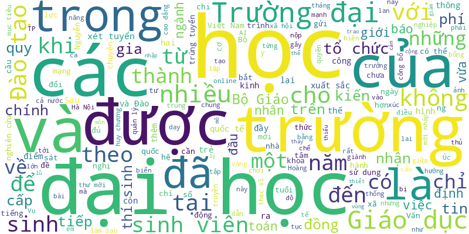
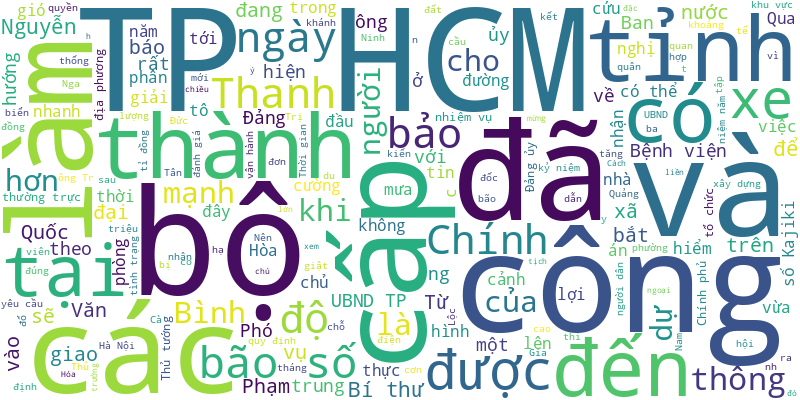
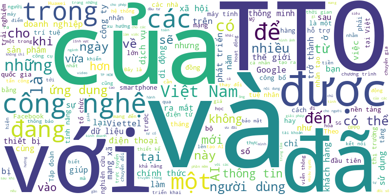

# Tuoi Tre RSS 

## Giáo dục 
- Summer Camp 2024 tại Trường Quốc tế Á Châu (Asian School) sẽ mang đến cho học sinh cơ hội trải nghiệm và trưởng thành.
- Tính đến ngày 20-5, đã có hơn 20 trường đại học, học viện công bố điểm chuẩn xét tuyển sớm theo phương thức xét học bạ.
- Kỳ thi vào lớp 10 công lập tại Hà Nội sắp đến gần, nhiều học sinh lớp 9 đang dành 17 giờ mỗi ngày để học bài, mỗi ngày học tới 4-5 ca.
- Giảng viên cho rằng tư vấn tuyển sinh là việc của bộ phận tuyển sinh, không thể buộc giảng viên, nghiên cứu viên phải học quy chế.
- Nhiều trung tâm dạy toán, tiếng Anh, kỹ năng sống tại Đà Nẵng đang rầm rộ tuyển sinh các lớp bán trú hè cho trẻ.
- Trường đại học Luật Hà Nội vừa công bố điểm chuẩn xét học bạ THPT, trong đó ngành luật kinh tế tổ hợp A00 và A01 lấy điểm chuẩn cao nhất 30/30 điểm. Thế nhưng vẫn có thí sinh đạt hơn 31 điểm.
- Các trường đại học thành viên của Đại học Quốc gia TP.HCM đều công bố học phí khóa tuyển sinh năm 2024, mức thu hầu hết đều tăng so với năm học trước.
- Học sinh tiểu học ở tỉnh Quảng Bình đang được yêu cầu tham gia cuộc thi Đại sứ văn hóa đọc với những câu hỏi quá khó so với lứa tuổi của các em.
- Lực lượng tìm kiếm đã tìm thấy thi thể nam sinh lớp 9 còn lại trên biển, cách hiện trường gặp nạn hàng chục km.
- UBND quận 4, quận 7, TP.HCM vừa công bố kế hoạch tuyển sinh lớp 6 ở Trường THCS Vân Đồn và Trường THCS Nguyễn Hữu Thọ.
- Với nhiều lý do như ngủ quên, kẹt xe, quên lịch thi... nhiều sinh viên phải tìm cách có bằng được giấy nghỉ bệnh để được trường đại học xem xét cho thi lại.
- Hiệp hội Giáo dục TP Christchurch (New Zealand) phối hợp cùng Cơ quan Giáo dục New Zealand (ENZ) sẽ triển khai chuỗi lớp học trải nghiệm mô phỏng môi trường học của New Zealand dành riêng cho học sinh Việt Nam.
- 17h chiều qua 19-5, cổng điều chỉnh nguyện vọng tuyển sinh lớp 10 công lập tại TP.HCM năm học 2024-2025 đã đóng lại. Sau khi thay đổi nguyện vọng, học sinh cần chú ý những gì?
- Tại sao các em biết đánh bạn là sai nhưng vẫn làm? Tại sao không em nào phản đối? Tại sao các học sinh khác của lớp ngồi dưới không lên tiếng?
- Khoảng 3h30 sáng nay 20-5, lực lượng tìm kiếm đã tìm thấy thi thể một nam sinh bị mất tích trên biển, cách hiện trường khoảng 5km.
- Trường Đại học Quốc tế Sài Gòn (SIU) là cơ sở giáo dục đầu tiên của phía Nam đào tạo ngành Công nghệ giáo dục.
- Mấy hôm nay vào lớp, học sinh dường như ngoan hơn hẳn, lớp học trang trí xinh xắn hơn, cô giáo cũng hạnh phúc hơn.
- 5 học sinh lớp 9 ở Hà Tĩnh rủ nhau đi tắm biển thì 2 em bị sóng đánh cuốn trôi, sau nhiều giờ tìm kiếm vẫn chưa thấy hai em học sinh mất tích.
- Học sinh tiểu học, THCS ở quận 8, TP.HCM thích thú tham gia loạt hoạt động trong ngày hội 'Em là công dân số'.
- 'Không có gì quá đặc biệt khi nói thế hệ Gen Z hay nhảy việc. Ở đâu các bạn cảm thấy công việc phù hợp thì các bạn sẽ dừng lại đó'.
- Nhiều học sinh ở quận Phú Nhuận, TP.HCM cho biết đã rất bất ngờ khi nhận được thư khen của cô trưởng Phòng Giáo dục và Đào tạo.
- Dù được khởi công xây dựng từ năm 2009, tuy nhiên đến nay chỉ một phần dự án khu nhà ở được đưa vào hoạt động, nhiều hạng mục xây dở dang và bỏ hoang phế.
- Đại học Quốc gia TP.HCM kéo dài thời gian đăng ký nguyện vọng xét tuyển trực tuyến của phương thức xét điểm thi đánh giá năng lực, do số thí sinh đăng ký xét tuyển còn thấp so với năm 2023.
- Sau ba ngày, số lượng học sinh đăng ký thay đổi nguyện vọng vào lớp 10 ở TP.HCM không nhiều.
- Đoàn Việt Nam đoạt giải nhì chính thức và giải tư của Hiệp hội Máy tính Mỹ tại Hội thi khoa học kỹ thuật quốc tế 2024. Cả 2 giải đều thuộc về học sinh Trường chuyên Lê Hồng Phong, TP.HCM.
- Bạo lực, kể cả về thể xác lẫn tinh thần, đều là phản giáo dục, không thể chấp nhận được trong môi trường giáo dục, thể hiện sự bất lực của người lớn khi không thể tìm được một cách nào tốt hơn.
- Kết hợp khoa học, công nghiệp và đổi mới sáng tạo sẽ tạo ra môi trường phát triển động lực, tăng cường sức mạnh cạnh tranh của doanh nghiệp
- Thành viên nhóm chuyên gia của dự thảo Luật Nhà giáo, khẳng định về chứng chỉ hành nghề đối với nhà giáo bên lề tọa đàm về dự án Luật Nhà giáo.
- Trường đại học Đà Lạt đã hợp tác với hơn 100 doanh nghiệp mở cổng thông tin việc làm để hỗ trợ sinh viên tìm việc.
- Nhiều ý kiến bạn đọc về vụ việc giáo viên chủ nhiệm ở TP.HCM cho 6 học sinh đánh bạn ngay trong lớp vì đi học muộn.

## Thời Sự 
- Cơn mưa lớn rạng sáng 21-5 khiến cát đỏ từ trên đồi cao lại trôi xuống đường như “lũ” khiến đường bị chia cắt, cuốn trôi xe cộ và ngập ở hai phường Mũi Né và Hàm Tiến, TP Phan Thiết, Bình Thuận.
- Quy định chỉ yêu cầu người dân cung cấp bản sao giấy tờ khi làm các thủ tục, nhưng vì sao cán bộ tiếp nhận và cơ quan giải quyết thủ tục nhất quyết yêu cầu phải là bản sao có công chứng, chứng thực không quá 6 tháng?
- Một số tin tức đáng chú ý: Lãi doanh nghiệp bất động sản giảm mạnh, hàng tồn kho tăng tiếp; Truy trách nhiệm các sự cố, tai nạn lao động trong ngành than; TP.HCM nỗ lực xóa 8 điểm đen tai nạn giao thông trong năm 2024...
- Theo chương trình kỳ họp thứ 7, từ cuối giờ chiều nay 21-5, Quốc hội sẽ bắt đầu tiến hành quy trình bầu Chủ tịch nước nhiệm kỳ 2021 - 2025.
- Hôm nay 21-5, mưa dông tăng trên cả nước, nhiều nơi chiều tối có mưa to đến rất to.
- 20 phút sau khi cất cánh, máy bay Airbus A321 đang trong chuyến bay đi Cần Thơ đã phải quay trở lại sân bay Nội Bài hạ cánh do tổ lái phát hiện có vết nứt trên kính buồng lái.
- Sở Xây dựng sẽ chủ trì cung cấp hồ sơ, chứng cứ, tài liệu liên quan các dự án trồng, chăm sóc cây xanh/chỉnh trang đô thị ở TP.
- Trong văn bản chính thức gửi đến lãnh đạo TP.HCM mới đây, nhà đầu tư kiến nghị thành phố tiếp tục các bước triển khai dự án BT nhà thi đấu Phan Đình Phùng.
- Đến 19h tối 20-5, tình hình giao thông trên đường Phạm Văn Đồng đoạn qua TP Thủ Đức vẫn hết sức căng thẳng vì một đoạn bị ngập.
- Việt Nam kiên định thực hiện chính sách 'Một Trung Quốc', công nhận Đài Loan là một phần không thể tách rời của lãnh thổ Trung Quốc, chỉ duy trì quan hệ dân gian với Đài Loan.
- Sở Thông tin và Truyền thông TP.HCM vừa phạt tiền và tước giấy phép trang thông tin điện tử tổng hợp cafeland.vn.
- Quyền Chủ tịch nước, Thủ tướng, Chủ tịch Quốc hội và Bộ trưởng Ngoại giao Việt Nam đã gửi điện chia buồn tới những người đồng cấp Iran sau tai nạn thảm khốc với Tổng thống Iran Ebrahim Raisi.
- Một đơn vị tư vấn giám sát đã gửi báo cáo đến nhiều cơ quan chức năng tỉnh Đắk Nông vì nghi giá thiết bị cao bất thường, có dấu hiệu sai phạm.
- Các dự án xã hội hóa lĩnh vực giáo dục, dạy nghề, y tế, văn hóa, thể thao, môi trường... được Đà Nẵng miễn giảm 30-100% tiền thuê đất.
- Học sinh tiểu học ở tỉnh Quảng Bình đang được yêu cầu tham gia cuộc thi Đại sứ văn hóa đọc với những câu hỏi quá khó so với lứa tuổi của các em.
- Chiều 20-5, mưa lớn như trút xuống khu vực chợ Thủ Đức, TP.HCM khiến đường sá ngập lênh láng, cống thoát nước lại bung lên.
- Người dân có nhu cầu cấp đổi giấy phép lái xe chỉ cần đến khám sức khỏe tại một trong số 9 cơ sở y tế tại Đà Nẵng, sau đó nhận giấy phép mới tại nhà.
- Đề xuất có cảnh vệ cho Thường trực Ban Bí thư, Chánh án Tòa án nhân dân tối cao, Viện trưởng Viện kiểm sát nhân dân tối cao. Chiều nay Bộ trưởng Bộ Công an Tô Lâm đã đề xuất như trên.
- Chủ tịch UBND TP Đà Nẵng vừa có chỉ đạo liên quan đến việc hủy bỏ tạm dừng giao dịch tài sản của vợ Phan Văn Anh Vũ (tức Vũ 'nhôm') và các công ty liên quan.
- Dự thảo Luật Quản lý, sử dụng vũ khí, vật liệu nổ và công cụ hỗ trợ (sửa đổi) bổ sung dao có tính sát thương cao vào nhóm vũ khí thô sơ.
- Còn 404/908 dự án, công trình không đưa hoặc chậm đưa đất vào sử dụng, với diện tích 18.308/28.155ha chưa được xử lý.
- Việc sớm mở rộng cao tốc TP.HCM - Long Thành - Dầu Giây được người dân hoan ngênh, vì sẽ tháo gỡ được các “nút thắt cổ chai” đã tồn tại lâu nay. Đặc biệt, đây là tuyến đường kết nối với sân bay Long Thành.
- Lực lượng tìm kiếm đã tìm thấy thi thể nam sinh lớp 9 còn lại trên biển, cách hiện trường gặp nạn hàng chục km.
- UBND tỉnh Phú Yên báo cáo từ năm 2019 đến 2023 trên địa bàn tỉnh thực hiện 55 dự án trồng, chăm sóc cây xanh… có tổng giá trị hơn 307 tỉ đồng.
- Với 475/475 đại biểu có mặt tán thành, Quốc hội đã thông qua nghị quyết bầu ông Trần Thanh Mẫn giữ chức vụ Chủ tịch Quốc hội khóa XV nhiệm kỳ 2021-2026.
- Liên quan tới sự việc hút cát thuộc địa phận tỉnh Phú Thọ khu vực giáp ranh huyện Ba Vì (Hà Nội) làm nứt tường nhà dân, Phó chủ tịch UBND TP Hà Nội Dương Đức Tuấn vừa có văn bản chỉ đạo.
- Ở TP.HCM có những 'ma trận' số nhà không chỉ bởi những dãy số siêu xuyệt rối ren mà còn vô vàn con đường, con hẻm, dãy nhà đặt số một cách vô lý, không thống nhất.
- Đại diện chuỗi cà phê và người nhà chị H.M.L. xác nhận với Tuổi Trẻ Online rằng hai bên đã thống nhất được phương án xử lý sau sự cố kính rơi trúng người. Tuy nhiên, họ không công bố cụ thể mức hỗ trợ.
- Nhóm thanh niên tại Thái Bình đi xe máy kẹp 3, vác theo giáo mác tự chế thị uy trên đường, không may đấu đầu xe tải khiến hai người chết tại chỗ.
- Sáng 20-5, Ban Quản lý dự án metro số 2 (thuộc Ban Quản lý đường sắt đô thị TP.HCM) thông tin đã hoàn thành khắc phục, tái lập mặt bằng ở khu vực sụt lún đường Võ Thị Sáu (quận 3).

## Nhịp sống số 
- Nhiều người thường ngại ngùng khi bắt chuyện lại với người bạn đã lâu không liên lạc. Các nhà khoa học đã có cách giúp họ.
- Nghiên cứu mới của ĐH Michigan (Mỹ) chỉ ra rằng cách tốt nhất để quản lý thời gian dùng điện thoại là... làm cho nó đơ ra mỗi khi xài lâu.
- Doanh nghiệp và người tiêu dùng đều cần công cụ để tự bảo vệ mình trước những hình thức gian lận mới của thanh toán số.
- Chỉ trong một thời gian ngắn, truyền hình MyTV của VNPT đã đạt được sự tăng trưởng thần tốc, thực sự trở thành người bạn đồng hành thân thiết với các gia đình Việt mỗi ngày.
- Kết nối Internet quốc tế gặp sự cố, chập chờn thường là cơn đau đầu của các nhà cung cấp dịch vụ trực tuyến.
- Với sự xuất hiện của 6G, thế hệ băng thông mở rộng tiếp theo sẽ mang đến nhiều công năng và bất ngờ hơn.
- Con chip này còn có thể dùng trong các hệ thống cảm biến và giám sát như trong xe tự hành hoặc để phát hiện lỗi nhỏ trong dây chuyền lắp ráp robot.
- Galaxy Z Fold là một biểu tượng của Samsung trong công nghệ mới, khi có khả năng gập đôi và màn hình rộng gần 8 inch.
- Để các đối tác nhà hàng, quán ăn được tiếp sức trên chặng đường đầy cạnh tranh, Gojek tiếp tục xây dựng kế hoạch hỗ trợ trong năm 2024.
- Kết hợp lợi ích của public cloud và các máy chủ vật lý trong một mô hình Hybrid tăng mức độ linh hoạt, khả năng mở rộng và hiệu quả chi phí tối ưu.
- Galaxy AI trên S24 chưa kịp ngưng sốt thì mới đây, người dùng có cơ hội trải nghiệm những tính năng thông minh trên dòng Galaxy Tab S9.
- Việc đầu tư khoảng 1 tỉ USD để đào tạo 50.000 kỹ sư bán dẫn sẽ gián tiếp tạo nguồn thu 15 - 16 tỉ USD cho nền kinh tế.
- Đại diện Cục Bản quyền tác giả nói môi trường số là môi trường xuyên biên giới, nên nạn đánh cắp bản quyền càng nghiêm trọng, khó giải quyết.
- Những thông tin bị đánh cắp có thể bao gồm thông tin đăng nhập vào nền tảng mạng xã hội, dịch vụ ngân hàng trực tuyến, ví điện tử, hệ thống nội bộ và email doanh nghiệp.
- TP.HCM thí điểm thực hiện học bạ số với toàn bộ học sinh lớp 1 của thành phố năm học 2023-2024 này.
- Với tốc độ 156.000 tỉ khung hình mỗi giây, máy ảnh mở ra khả năng ghi lại những hiện tượng xảy ra cực nhanh mà trước nay không nhìn thấy được.
- Các tổ chức bảo vệ quyền trẻ em lên tiếng phản đối sau khi Meta hạ độ tuổi tối thiểu sử dụng ứng dụng nhắn tin WhatsApp tại Liên minh châu Âu (EU) từ 16 xuống 13 tuổi.
- Ngoài làm mờ tin nhắn có ảnh khỏa thân, Meta cũng đang phát triển công nghệ xác định tài khoản lừa đảo sextort (tin tặc lừa đang giữ ảnh nóng của người dùng).
- Nhà báo Vũ Kim Hạnh, sẽ xuất hiện trên sóng Shopee Live vào ngày 15-4 trong một sáng kiến mới nhằm hỗ trợ các doanh nghiệp địa phương trong cả nước giới thiệu nông đặc sản chất lượng.
- Nếu Công ty Netflix không tuân thủ, Bộ Thông tin và Truyền thông sẽ phối hợp các cơ quan quản lý nhà nước liên quan xử lý theo quy định pháp luật Việt Nam.
- Chìa khóa giải mã cho sự phát triển vượt trội của TV360 và Viettel Money là nền tảng khổng lồ của Tập đoàn công nghệ lớn nhất Việt Nam - Viettel.
- Những video, âm thanh và hình ảnh do AI tạo ra hoặc do AI thay đổi nội dung sẽ được Meta gắn nhãn 'tạo bởi AI' để phân biệt với những sản phẩm khác.
- Chuyên gia cảnh báo các cuộc tấn công mạng có xu hướng 'tự động hóa và cá nhân hóa' khi kẻ tấn công sử dụng thư điện tử lừa đảo và cuộc gọi điện thoại giả mạo do AI điều khiển để đánh lừa nạn nhân.
- Hầu hết trình duyệt web hiện nay cho phép người dùng sử dụng chế độ ẩn danh như một cách để bảo vệ quyền riêng tư.
- Sự phát triển của nhiều hình thức kinh doanh mới, nhu cầu làm việc từ xa tăng mạnh v.v. khiến doanh nghiệp phải tìm giải pháp mở rộng đường truyền.
- OpenAI giới thiệu công cụ có thể nhại giọng con người chỉ với một mẫu âm thanh 15 giây, nhưng chưa tung ra công cụ này do các lo ngại về an ninh.
- Vinh danh những cá nhân, tập thể đóng góp lớn cho hoạt động sản xuất kinh doanh năm 2023, Tập đoàn Công nghiệp - Viễn thông Quân đội (Viettel) cũng hé lộ những đột phá lớn sau năm năm tuyên bố trở thành tập đoàn công nghệ.
- Ngoài việc đánh cắp thông tin cá nhân, tin tặc có thể lợi dụng lỗ hổng để chèn một 'lớp' mới vào giữa người dùng và nguồn ảnh thông thường của thiết bị.
- Giành ngôi vô địch ở giải đấu của những hacker hàng đầu thế giới ở tuổi 20, nghiên cứu công nghệ 5G từ khi còn ngồi trên ghế nhà trường…
- Qua 15 năm hoạt động, dấu ấn của Vietnamobile để lại trong lòng khách hàng xuất phát từ chính ưu đãi hấp dẫn về giá và dữ liệu.

