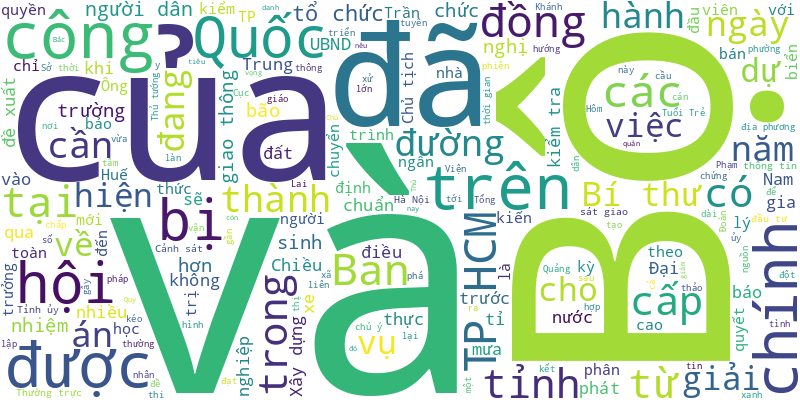

# Tuoi Tre RSS 

## Giáo dục 
- Năm học mới, Hà Nội dự kiến dành hơn 3.000 tỉ đồng hỗ trợ bữa ăn bán trú cho học sinh tiểu học.
- Nhân dịp khai giảng năm học mới 2025-2026, cũng là dịp kỷ niệm 80 năm truyền thống ngành giáo dục, Chủ tịch nước Lương Cường có thư gửi ngành giáo dục, thầy trò trên cả nước.
- Dự báo trong dịp khai giảng năm học 2025-2026 (ngày 4 và 5-9), thời tiết trên cả nước phổ biến ít mưa vào ban ngày.
- Đến nay đã có gần 50 trường đại học trên cả nước công bố xét tuyển bổ sung năm 2025, trong đó có nhiều trường tốp đầu, ngành hot.
- Ngày 3-9, Sở Giáo dục và Đào tạo TP.HCM đã có công văn gởi các cơ sở giáo dục và các sở, ban ngành, đoàn thể, tổ chức, doanh nghiệp,… về lễ khai giảng năm học mới.
- Thủ tướng Chính phủ vừa có quyết định điều động, bổ nhiệm ông Lê Quân, chủ tịch hội đồng, giám đốc Đại học Quốc gia Hà Nội, giữ chức thứ trưởng Bộ Giáo dục và Đào tạo.
- Giám đốc Sở Giáo dục và Đào tạo TP.HCM cho biết kinh phí đào tạo giáo viên được lấy từ nguồn ngân sách thành phố.
- PGS.TS Vũ Hải Quân - giám đốc Đại học Quốc gia TP.HCM - vừa được điều động, bổ nhiệm làm thứ trưởng thường trực Bộ Khoa học và Công nghệ.
- Các hình ảnh thiếu ý thức, từ leo trèo, chen lấn đến xả rác bừa bãi đang ảnh hưởng đến sự trang nghiêm trong các sự kiện.
- Sáng 3-9, Trường tiểu học Nguyễn Bỉnh Khiêm, phường Sài Gòn, TP.HCM đã khánh thành phòng học kỹ năng công dân số.
- Lễ khai giảng năm học 2025-2026 cũng là dịp kỷ niệm 80 năm thành lập Bộ Quốc gia giáo dục (nay là Bộ GD-ĐT), được tổ chức khác biệt so với các năm trước.
- Dù là những ngày nghỉ lễ Quốc khánh 2-9, ký túc xá Đại học Quốc gia TP.HCM vẫn mở cửa đón hàng ngàn tân sinh viên đến làm thủ tục nhập ở, khiến nhiều người bất ngờ, xúc động.
- Hơn ba năm sau khi xung đột Nga - Ukraine bùng nổ, các bậc phụ huynh tại Kharkov đã đưa con em mình tới những ngôi trường đặc biệt nằm dưới lòng đất để bắt đầu năm học mới.
- 15m², 11 năm, hàng trăm đứa trẻ cơ nhỡ có con chữ đã gặp nhau ở một lớp học, với tình yêu thương của những người thầm lặng.
- Nhiều ý kiến cho rằng việc Trường đại học Quốc tế (Đại học Quốc gia TP.HCM) phân bổ theo nhóm ngành sau khi trúng tuyển dẫn đến tình trạng thí sinh trúng tuyển nhưng không biết chắc mình sẽ học ngành nào là không thể chấp nhận.
- Hình ảnh Việt Nam giai đoạn 1930-1940 hiện lên sống động và chân thực thông qua những bức ảnh của Sofia Yablonska. Những bức ảnh ấy đã được ông Roby Bellemans (người Hà Lan) sưu tầm, trưng bày, giới thiệu đến trẻ em đang sinh sống ở TP Đà Nẵng.
- Khi đến làm thủ tục nhập học, tân sinh viên mới biết mình không được tự do lựa chọn ngành mà phải tham gia vào một quy trình phân bổ dựa trên nguyện vọng và điểm số của trường.
- 100 học sinh của đoàn nhạc kèn học sinh Trường THCS Võ Thành Trang (TP.HCM) đã vượt 1.700km ra Hà Nội để thể hiện màn biểu diễn giàu cảm xúc tại khu vực Tượng đài vua Lý Thái Tổ (Hà Nội) nhân dịp Quốc khánh 2-9 trong sáng 31-8.
- Mỗi mùa thu, Trường đại học Công nghệ TP.HCM (HUTECH) lại chào đón hàng nghìn tân sinh viên từ khắp mọi miền đất nước, mang theo những câu chuyện rất riêng - xúc động, truyền cảm hứng và đầy nghị lực.
- Dưới đây là lời khuyên của bác sĩ dành cho các bậc phụ huynh để con cái mình có một năm học như mong muốn.
- Sinh viên, học viên và nghiên cứu sinh có cơ hội vay vốn ưu đãi với lãi suất 4,8%/năm để trang trải học phí, sinh hoạt phí và chi phí học tập theo quy định mới của Chính phủ.
- Hơn 1.800 học sinh Trường tiểu học, THCS và THPT Hoàng Việt (phường Buôn Ma Thuột, tỉnh Đắk Lắk) trong đồng phục, tay cầm cờ đỏ sao vàng đã tạo nên màn xếp hình bản đồ Việt Nam chào mừng Quốc khánh 2-9.
- Mưa lũ kéo dài sau cơn bão số 5, hàng trăm mét khối đất đá đổ vào phòng học, sân, cổng trường tiểu học, mầm non ở bản Cha Lung, xã biên giới Tam Thanh, tỉnh Thanh Hóa.
- Dù không được phê duyệt chỉ tiêu lớp 1, Trường tiểu học quốc tế Thăng Long vẫn tuyển sinh, khiến hơn 50 học sinh không có mã số học sinh, không có điểm số trên hệ thống dữ liệu ngành.
- Sở Giáo dục và Đào tạo TP.HCM vừa công bố các khoản thu trong trường công lập năm học 2025-2026 với từng bậc học.
- Phòng An ninh chính trị nội bộ Công an TP.HCM vừa xử phạt 4 người có hành vi thi thay tại kỳ thi đánh giá năng lực ngoại ngữ 6 bậc tiếng Anh.
- Bộ Giáo dục và Đào tạo vừa công bố gia hạn thời gian mở hệ thống hỗ trợ tuyển sinh chung của bộ để thí sinh xác nhận nhập học.
- Nguyễn Thị Minh Thùy mắc căn bệnh viêm não Nhật Bản với di chứng liệt gần nửa cơ thể tưởng chừng như không thể tiếp tục đi học.
- Hiện trường chỉ có 22 em học sinh, trong khi số lượng giáo viên là 23 người.
- Sáng 30-8, Trường đại học Kinh tế - Đại học Đà Nẵng tổ chức lễ kỷ niệm 50 năm xây dựng và phát triển (1975-2025),
- Sau khi rà soát dữ liệu, Trường đại học Tài chính - Marketing phát hiện sai sót dẫn đến hàng chục thí sinh đậu thành rớt, rớt thành đậu.
- Sau khi Trường đại học Thái Bình Dương quyết định tặng 100.000 đồng cho toàn thể sinh viên, có thêm hai trường đại học ở TP.HCM cũng lì xì.
- Nhiều giáo viên ở phường Bình Kiến (tỉnh Đắk Lắk) phản ánh đến đường dây nóng Tuổi Trẻ Online về việc bị chậm lương suốt 2 tháng nay.
- Hơn 1 năm qua, 79 giáo viên mầm non của hệ thống Trường Pathway Tuệ Đức đã được các chuyên gia âm nhạc đào tạo.
- Sau khi Trường đại học Ngân hàng TP.HCM thông báo bổ sung danh sách trúng tuyển do lỗi kỹ thuật, nhiều thí sinh rơi vào tình huống "tiến thoái lưỡng nan" vì đã xác nhận nhập học ở trường khác theo hệ thống của Bộ Giáo dục và Đào tạo.
- Nhiều doanh nghiệp đang chạy đua đào tạo và tuyển dụng nhân lực đường sắt tốc độ cao, đường sắt đô thị.
- Xã Củ Chi - xã có dân số đông nhất trong 7 xã sau sáp nhập tại huyện Củ Chi cũ - đã khánh thành Trường tiểu học Tân Thông Hội vào sáng 29-8.
- Chỉ tính riêng ngành y khoa ở Trường đại học Y Hà Nội và Trường đại học Y Dược TP.HCM, số thí sinh được cộng điểm chiếm số lượng áp đảo, nhiều thí sinh có tổng điểm vượt 30.
- Thí sinh trúng tuyển đại học cần phải xác nhận nhập học trên hệ thống xét tuyển chung của Bộ Giáo dục và Đào tạo trong thời hạn quy định, nếu không sẽ bị hủy kết quả.
- Kỳ tuyển sinh 2025 khép lại với nhiều nghịch lý: điểm chuẩn 29 - 30 lan rộng, có em dư điểm vẫn rớt, hệ thống tra cứu - lọc ảo trục trặc.
- Sau sáp nhập, ngành giáo dục TP.HCM trở thành 'siêu đô thị' về giáo dục với quy mô lớn nhất cả nước.
- Trường đại học Thái Bình Dương (trụ sở tại tỉnh Khánh Hòa) quyết định tặng 100.000 đồng cho toàn thể học viên, sinh viên và tân sinh viên.
- Trước thềm năm học mới, phụ huynh phản ánh nhiều trường học tại tỉnh Đắk Lắk cho học sinh mặc nhiều kiểu đồng phục mỗi tuần.
- Sau hợp nhất, UBND tỉnh Đắk Lắk đã có quyết định "trả lại tên" cho 14 trường THPT ở tỉnh Phú Yên trước đây.
- Sinh viên có khởi đầu thuận lợi tại Việt Nam, đồng thời có cơ hội tiếp xúc quốc tế tại các trường xếp hạng cao ở nước ngoài trong tương lai.
- Từ một cú click chuột trên Google, Garnier Pierrick - sinh viên ngành kỹ thuật điện tại Trường kỹ thuật CESI, Đại học Nantes (Pháp) - đã quyết định chọn Trường đại học Công nghiệp TP.HCM là điểm đến thực tập quốc tế trong bốn tháng.
- Cùng công tác tại một đại học, cùng đoạt giải Quả cầu vàng khoa học công nghệ, cùng là gương mặt trẻ Việt Nam tiêu biểu. Mới đây nhất, cả hai nhà khoa học trẻ này cùng hiện diện trong khối tri thức thuộc lễ diễu binh, diễu hành dịp 2-9.
- Chiều ngày 28-8, tại Trường đại học Tôn Đức Thắng diễn ra Gala chung kết cuộc thi "Sinh viên Việt Nam với hiểu biết tài chính - Investment Challenge 2025".
- Tỉ lệ nữ tham gia nghiên cứu khoa học ở Việt Nam là khoảng 45%, trong khi đó Nhật Bản khoảng 17%, Hàn Quốc 20-25%, Trung Quốc khoảng 28%...
- Do ảnh hưởng của bão số 5, ba ngày qua ở xã biên giới Yên Khương, tỉnh Thanh Hóa có mưa lớn kéo dài. Lũ ống cuốn hàng trăm mét khối đất đá đổ vào điểm trường ở bản Xắng Hằng.

## Thời Sự 
- Chính phủ vừa ban hành Nghị quyết 268 về tình hình triển khai thực hiện và vận hành mô hình chính quyền địa phương 2 cấp.
- Cảnh sát cứu hộ thành công hai du khách quốc tịch Nga bị kiệt sức, mất phương hướng khi leo núi Cô Tiên, tỉnh Khánh Hòa.
- Nhân dịp khai giảng năm học mới 2025-2026, cũng là dịp kỷ niệm 80 năm truyền thống ngành giáo dục, Chủ tịch nước Lương Cường có thư gửi ngành giáo dục, thầy trò trên cả nước.
- Hôm nay 4-9, thời tiết Bắc Bộ ngày nắng, có nơi nắng nóng. Nam Bộ mưa rào, chiều tối mưa to.
- Tin tức đáng chú ý: Giảm 30% phí, lệ phí đăng ký xe, rút ngắn thời gian cấp, cấp lại và đổi giấy phép lái xe; Có website giả giải chạy hỗ trợ bệnh nhân ung thư; 7 bác sĩ chuyên khoa đầu ngành tại TP.HCM đã đến đặc khu Côn Đảo...
- Tổ công tác của Bộ Chính trị làm việc với các tỉnh Ninh Bình, Đắk Lắk, Lào Cai để cho ý kiến chuẩn bị đại hội, phương hướng nhân sự nhiệm kỳ 2025 - 2030.
- Chiều 3-9, Đại tướng Phan Văn Giang, bộ trưởng Bộ Quốc phòng, đã gửi thư tới các cơ quan báo chí trong và ngoài quân đội, ghi nhận và cảm ơn những đóng góp “vượt nắng, thắng mưa” trong đưa tin, tuyên truyền về diễu binh, diễu hành A80.
- Chiều 3-9, Công an xã Gio Linh (Quảng Trị) xác nhận trên địa bàn vừa xảy ra vụ tai nạn đuối nước khiến  hai em nhỏ tử vong.
- Tối 3-9, ông Lương Minh Phúc, giám đốc Ban Quản lý dự án đầu tư xây dựng các công trình giao thông (chủ đầu tư), thông tin ban đầu về tai nạn lao động tại công trường thi công dự án vành đai 3 TP.HCM.
- Trung tâm Quản lý hạ tầng giao thông đường bộ (Sở Xây dựng TP.HCM) cho biết sẽ điều chỉnh tổ chức giao thông trên đường Võ Chí Công (từ cầu Phú Mỹ đến nút giao Mỹ Thủy), phường Cát Lái.
- Trong 11 đề nghị của UBND tỉnh Tây Ninh gửi đến UBND TP.HCM về các tuyến giao thông chính kết nối với TP.HCM, có 9 đề nghị về các dự án đường bộ, 1 đề nghị bổ sung tuyến đường sắt và 1 đề nghị nạo vét đường thủy.
- Ban Chỉ đạo Trung ương kỷ niệm các ngày lễ lớn và sự kiện lịch sử quan trọng của đất nước trong 3 năm 2023 - 2025 đã gửi thư cảm ơn tới đồng bào, chiến sĩ, các lão thành cách mạng, các ban ngành...
- Chuyên gia cho rằng thực trạng thời gian qua TP.HCM chưa thu hút được nhà đầu tư chiến lược nào, và đề ra các giải pháp để thu hút nhà đầu tư chiến lược vào hạ tầng đô thị, nhất là đường sắt.
- Ngày 3-9, Công an tỉnh Đồng Tháp cho biết liên tục trong những ngày cuối tháng 8, đầu tháng 9-2025 Công an phường Thới Sơn đã phát hiện, xử phạt liên tiếp nhiều "cát tặc" trên địa bàn.
- Nghị quyết của Bộ Chính trị yêu cầu khẩn trương triển khai các dự án điện hạt nhân Ninh Thuận 1 và Ninh Thuận 2 với các đối tác phù hợp, bảo đảm lợi ích cao nhất của Việt Nam.
- Chiều 3-9, một vụ tai nạn lao động nghiêm trọng đã xảy ra tại công trường xây dựng vành đai 3 (đoạn qua phường Long Bình, TP.HCM) khiến 1 công nhân tử vong và 1 người bị thương được đưa đi cấp cứu.
- Ngã tư Đồng Tâm là điểm đầu cầu Rạch Miễu 2 đã bị ùn ứ trong hai ngày liên tiếp đầu tháng 8, sau nửa tháng thông xe. Để giải quyết bài toán này, nên làm cầu vượt, hầm chui hay đơn giản chỉ điều chỉnh pha đèn hoặc phân luồng giao thông?
- Thủ tướng Phạm Minh Chính chủ trì buổi làm việc của Bộ Chính trị với Ban Thường vụ Tỉnh ủy An Giang và Lâm Đồng, cho ý kiến vào dự thảo các văn kiện, phương án nhân sự đại hội đảng bộ.
- Bạn đọc phản ánh cơ quan chức năng cấp đất của mình cho một người khác. Vậy phải làm thế nào để 'trả' thửa đất đó lại cho chủ cũ?
- Bộ Nội vụ đề xuất các tiêu chí, điều kiện tổ chức lại, giải thể đơn vị sự nghiệp công lập.
- Ngày 3-9, tàu SE67 xuất phát từ ga Hà Nội đã lăn bánh, đưa các chiến sĩ Quân khu 5, Quân đoàn 34 về đơn vị sau khi hoàn thành nhiệm vụ A80.
- Khu di tích nơi có đền thờ và phần mộ cụ Phó bảng Nguyễn Sinh Sắc (phường Cao Lãnh, tỉnh Đồng Tháp) được tỉnh Đồng Tháp đầu tư tôn tạo, tu bổ với kinh phí hơn 145 tỉ đồng.
- Cơn mưa lớn đêm 2-9 khiến đất cát theo nước tràn xuống ngập mặt đường, giao thông trên cao tốc Vĩnh Hảo - Phan Thiết phải gián đoạn một thời gian.
- Ngày 3-9, Sở Xây dựng Hà Nội vừa có thông báo về việc điều chỉnh tổ chức giao thông trên nhánh Ramp CV1C hướng các phương tiện từ cầu Vĩnh Tuy rẽ phải đi đường Nguyễn Khoái, sau vụ cháy bãi trông giữ xe dưới chân cầu ngày 30-8 làm lộ cốt thép.
- Sở Y tế tỉnh An Giang đã ký quyết định tạm đình chỉ công tác đối với giám đốc Trung tâm y tế An Phú 90 ngày, để phục vụ công tác của đoàn kiểm tra liên quan đến quy định pháp luật về tài chính.
- Nhóm nghi phạm từ các tỉnh phía Bắc vào Quảng Trị hoạt động cho vay lãi nặng tổng số tiền 25 tỉ đồng, thu lãi 10 tỉ đồng. Tức mức lãi cao nhất lên đến 644%/năm.
- Nội dung 'Vợ hoặc chồng đi nhậu quá 20 giờ có thể bị xử phạt nghiêm, mức phạt dự kiến lên đến 30 triệu đồng' phát tán trên mạng xã hội cùng hình ảnh đại biểu Quốc hội là gán ghép và Công an tỉnh Lâm Đồng đang làm rõ.
- Ông Vũ Mạnh Hà, phó bí thư thường trực Tỉnh ủy Lai Châu được bổ nhiệm giữ chức thứ trưởng thường trực Bộ Y tế.
- Thủ tướng Chính phủ vừa có quyết định tiếp nhận, bổ nhiệm ông Nguyễn Văn Quảng, bí thư Thành ủy Đà Nẵng giữ chức phó tổng thanh tra thường trực Thanh tra Chính phủ.
- Ngày 3-9, đại diện Phòng Cảnh sát giao thông Công an TP.HCM cho biết dịp lễ 2-9 đã xử lý hơn 9.500 trường hợp vi phạm, trong đó có 2.200 người vi phạm nồng độ cồn.
- Thủ tướng Chính phủ vừa có quyết định điều động, bổ nhiệm ông Lê Quân, chủ tịch hội đồng, giám đốc Đại học Quốc gia Hà Nội, giữ chức thứ trưởng Bộ Giáo dục và Đào tạo.
- Trưa 3-9, lực lượng Công an TP.HCM vẫn đang phối hợp các đơn vị liên quan điều tra nguyên nhân 2 vụ tai nạn giao thông làm 3 người chết xảy ra trong một buổi sáng nay.
- TS Nguyễn Viết Chức đánh giá sự kiện kỷ niệm 80 năm Cách mạng Tháng Tám và Quốc khánh 2-9 tiếp tục cho thấy dưới sự lãnh đạo tuyệt đối, sáng suốt của Đảng và sự đoàn kết toàn dân có thể nhấn chìm mọi kẻ xâm lược, cuốn phăng mọi trở lực.
- Sáng 3-9, tại Hà Nội, Thượng tướng Hoàng Xuân Chiến và Thượng tướng Alexander Vasilyevich Fomin  đã đồng chủ trì Đối thoại chiến lược quốc phòng lần thứ 8.
- Bộ Xây dựng đang lấy ý kiến dự thảo Luật Xây dựng sửa đổi theo hướng rút ngắn thời gian cấp phép xây dựng công trình xuống còn 7 ngày, và tăng nhóm công trình xây dựng được miễn cấp phép.
- Đà Nẵng thành lập tổ công tác kiểm tra, rà soát và thúc đẩy tiến độ loạt dự án bất động sản bị “đứng bánh” nhiều năm qua. Đây là các dự án do Bách Đạt An, Dana Homeland và Chí Thành làm chủ đầu tư - khiến hàng ngàn khách hàng mòn mỏi chờ sổ đỏ.
- Đó là khẳng định của Thượng tướng Álvaro López Miera, bộ trưởng Bộ Các lực lượng vũ trang cách mạng Cuba, tại buổi hội đàm cùng với Đại tướng Phan Văn Giang sáng nay 3-9, tại trụ sở Bộ Quốc phòng.
- Ngay sau khi TP.HCM công bố chính sách hỗ trợ 5 triệu cho phụ nữ sinh đủ 2 con trước 35 tuổi, hàng trăm ý kiến của bạn đọc đã gửi về báo Tuổi Trẻ Online.
- TP Huế hiện là một trong những địa phương đứng top đầu trong việc trao ‘lì xì’ Tết Độc lập của Chính phủ cho người dân.
- Sáng 3-9, Cơ quan cảnh sát điều tra Công an tỉnh An Giang cho biết sau thời gian điều tra, xác minh đã ra quyết định khởi tố vụ án, khởi tố 13 người về tội tổ chức sử dụng trái phép chất ma túy tại quán karaoke ở Phú Quốc.
- Hôm qua (2-9), lễ diễu binh diễu hành kỷ niệm 80 năm Cách mạng Tháng Tám và Quốc khánh 2-9 đã được tổ chức trọng thể tại quảng trường Ba Đình (Hà Nội).
- Chính phủ vừa ban hành Nghị định số 237 sửa đổi, bổ sung một số điều của Nghị định số 105/2012 ngày 17-12-2012 của Chính phủ về tổ chức lễ tang cán bộ, công chức, viên chức.
- Cục Xe máy - Vận tải đã phối hợp các đơn vị lên kế hoạch chi tiết đưa, đón các cán bộ, chiến sĩ thuộc các khối diễu binh, diễu hành trở về đơn vị đang công tác, bảo đảm chu đáo, an toàn.
- Sáng 3-9, ngày đầu đi làm lại sau kỳ nghỉ lễ 2-9, hàng ngàn xe ùn ứ nghiêm trọng tại vòng xoay cầu Bình Lợi (phường Hiệp Bình, TP.HCM), lực lượng cảnh sát giao thông căng mình điều tiết.
- Một số tin tức đáng chú ý: Hai ái nữ sếp VPBank chi xong nghìn tỉ mua cổ phiếu; Hải Phát lùi ngày đáo hạn lô trái phiếu 500 tỉ đồng; TP.HCM kiến nghị thuận chủ trương giải ngân dự án thành phần vành đai 3, 4...
- Hôm nay 3-9, thời tiết Bắc Bộ nắng sau nhiều ngày mưa dông. Nam Bộ mưa rào, chiều tối có nơi mưa to đến rất to.
- Trong thư khen gửi công an các đơn vị, địa phương, Bộ trưởng Lương Tam Quang biểu dương tinh thần, nỗ lực bảo đảm tuyệt đối an ninh, an toàn chuỗi sự kiện kỷ niệm 80 năm Cách mạng Tháng Tám và Quốc khánh 2-9.
- Tối 2-9, hàng ngàn người dân đổ về trung tâm thành phố Hà Nội để ngắm pháo hoa tầm cao kết hợp tầm thấp sáng rực bầu trời nhân kỷ niệm 80 năm Cách mạng Tháng Tám và Quốc khánh 2-9.
- Bộ Xây dựng vừa yêu cầu kiểm định, đánh giá chất lượng và khả năng khai thác công trình cầu Vĩnh Tuy sau vụ cháy bãi gửi xe dưới gầm cầu làm bong vỡ bê tông, lộ cốt thép cầu.
- Dự báo trong tháng 9, có thể có 2-3 cơn bão hoặc áp thấp nhiệt đới hoạt động trên Biển Đông và không loại trừ có xoáy thuận nhiệt đới ảnh hưởng đến đất liền nước ta.

## Nhịp sống số 
- Google bác bỏ tin đồn trên mạng xã hội cho rằng hãng đã gửi cảnh báo khẩn đến 2,5 tỉ người dùng Gmail sau một vụ rò rỉ dữ liệu.
- Việc Meta đàm phán sử dụng các mô hình AI của Google và OpenAI là dấu hiệu rõ ràng về sự thay đổi lớn trong chiến lược của những 'gã khổng lồ' công nghệ.
- Microsoft và hãng sản xuất bộ điều khiển SSD Phison bác bỏ tin đồn lan truyền trên mạng xã hội hồi tháng 8 cho rằng các bản cập nhật Windows 11 đã gây lỗi nghiêm trọng, làm hỏng ổ SSD.
- Khu trưng bày ngành game, ngành điện ảnh và ngành thủ công mỹ nghệ trở thành tâm điểm thu hút giới trẻ ở Triển lãm thành tựu đất nước.
- Microsoft vừa công bố hai mô hình AI đầu tiên do chính tập đoàn phát triển, trong đó có mô hình tạo 1 phút âm thanh chỉ trong 1 giây.
- Việc TP Đà Nẵng thí điểm dự án chuyển đổi tài sản mã hóa đang thu hút nhiều quan tâm. Chủ tịch Tập đoàn Công nghệ Kogi, nguyên chủ tịch Hiệp hội Doanh nhân Việt Nam tại nước ngoài Peter Hồng (Nguyễn Hồng Huệ) nói "thế giới đã đánh hơi được".
- Cơ quan Cảnh sát Quốc gia Nhật Bản mới đây xác nhận sẽ đưa ứng dụng trí tuệ nhân tạo (AI) vào việc phân tích thông tin nhằm truy bắt các đối tượng cầm đầu của nhóm tội phạm ẩn danh và lưu động xuyên quốc gia.
- Một số video trên YouTube bỗng hiển thị khác với bản gốc, từ màu sắc đến độ nét đều được tự động thay đổi. Vì sao có chuyện này, và liệu người sáng tạo có thể kiểm soát?
- Một buổi sáng, bạn bật máy tính. Trên màn hình không chỉ là danh sách công việc mà cả giờ ăn, lịch nghỉ, lộ trình di chuyển cũng được phần mềm AI lập trình sẵn, tối ưu đến từng phút.
- Các chuyên gia cảnh báo thông tin sai lệch kém rõ ràng và nguy hiểm đang được phát tán thông qua các tính năng AI của Google.
- Học sinh ở Hàn Quốc sẽ bị cấm sử dụng điện thoại thông minh và thiết bị thông minh trong giờ học, theo luật mới được Quốc hội thông qua.
- Diễn ra từ 26, 27-8, triển lãm và diễn đàn quy mô nhất nước chuyên ngành khách sạn, nhà hàng, cà phê, dịch vụ ăn uống HorecFex Việt Nam 2025, không chỉ là không gian gặp gỡ của doanh nghiệp mà còn là sân chơi để phô diễn những xu thế công nghệ mới.
- Nhiều tin đồn xoay quanh iPhone 17, Apple Watch và AirPods rộ lên khi gần đến thời điểm ra mắt các sản phẩm mới của Apple.
- Đơn kiện cáo buộc Apple và OpenAI 'thông đồng' để làm giảm sức cạnh tranh trong lĩnh vực trí tuệ nhân tạo (AI).
- Nhiều người dùng tin rằng chatbot AI thông minh hơn khi trả lời bằng tiếng Anh. Nhưng liệu đây có phải là sự thật, hay chỉ là tin đồn nảy sinh từ thói quen sử dụng công nghệ?
- vivo V60 5G sẽ ra mắt vào ngày 26-8-2025 với Hệ thống camera chính ZEISS, Camera Siêu Tele Chân Dung ZEISS và loạt ưu đãi hấp dẫn khi đặt trước lên đến sáu triệu đồng
- Không chỉ nghe, nhìn, nói, AI giờ đây còn có thể “ngửi mùi”. Công nghệ khứu giác số mở ra ứng dụng từ y tế hơi thở, kiểm định thực phẩm, đến tạo ra những hương nước hoa độc bản chỉ trong vài cú nhấp chuột.
- Apple thông báo sẽ sản xuất toàn bộ dòng sản phẩm iPhone 17 tại các nhà máy đặt tại Ấn Độ, dấu hiệu rõ ràng cho thấy họ đang 'hạn chế' phụ thuộc vào Trung Quốc.
- Theo OpenAI, ChatGPT Go cho phép người dùng gửi số lượng tin nhắn và tạo hình ảnh gấp 10 lần so với bản miễn phí, đồng thời có tốc độ phản hồi nhanh hơn.
- Hằng tháng có 280 triệu người dùng ứng dụng chỉnh sửa ảnh AI Meitu, trong đó 98 triệu đến từ các thị trường ngoài Trung Quốc đại lục.
- Instagram Map ra đời nhằm xóa mờ ranh giới giữa thế giới ảo và thực, nhưng thay vì kết nối mọi người, nó lại khiến người dùng lo bị theo dõi.
- Thông tin lan truyền rằng tính năng Meta AI trên WhatsApp mặc định truy cập mọi cuộc trò chuyện nếu không bật "Advanced Privacy".
- Chỉ bằng vài câu lệnh, AI đã có thể dựng nên những khung hình sống động, từ bối cảnh, ánh sáng đến từng chuyển động nhỏ... Nó làm điều đó thế nào?
- Các nhà báo châu Âu ngày càng sử dụng nhiều công cụ AI tạo sinh trong tòa soạn, bất chấp lo ngại công nghệ này có thể làm phát sinh tin giả và xói mòn niềm tin.
- Một dạng video mới mang tên “bác sĩ deepfake” đang lan truyền trên mạng xã hội, với các nhân vật trông và nghe như thật nhưng thực chất chỉ là sản phẩm của xu hướng AI mới nhất.
- Chỉ điện thoại tích hợp AI, du khách sẽ 'đọc' được những chữ tượng hình trên bức tượng, tờ giấy cói... của nền văn minh Ai Cập cổ đại.
- Điều tra của Full Fact phát hiện Google Lens cung cấp thông tin sai hoặc gây hiểu nhầm về hình ảnh lan truyền trên mạng.
- Chính phủ Hàn Quốc vừa quyết định tạm hoãn việc phê duyệt yêu cầu của Google về quyền truy cập và xuất khẩu dữ liệu bản đồ địa lý chi tiết của quốc gia này, một bước đi nhằm thận trọng đánh giá các rủi ro an ninh liên quan đến dữ liệu số.
- Nếu hệ thống xác định một người dùng dưới 18 tuổi, YouTube sẽ hạn chế truy cập những nội dung không phù hợp lứa tuổi.
- DeepSeek, mô hình AI của Trung Quốc, đã gây chấn động thị trường khi chứng minh rằng có thể tạo ra một mô hình mạnh mẽ với chi phí thấp.
- Chỉ cần gõ từ khóa 'Brain Rot' trên bất kỳ mạng xã hội nào, người dùng lập tức bị bủa vây bởi một loạt video có hình ảnh sặc sỡ, nhân vật kỳ quái...
- Từ lỗ hổng này, tin tặc có thể khiến ChatGPT gợi ý người dùng tải về phần mềm chứa vi rút, đưa ra lời khuyên kinh doanh sai lệch, thậm chí truy cập các tệp tin trên Google Drive...
- Nắm rõ một số dấu hiệu cảnh báo, phát hiện và sửa chữa càng sớm càng tốt khi bị hack điện thoại giúp hạn chế thiệt hại.
- Thông tin rò rỉ về các sản phẩm trong series iPhone 17, dự kiến ra mắt vào tháng 9-2025, tiếp tục được nhiều nguồn uy tín tung ra.
- Công nghệ có thể truyền tải tri thức nhanh hơn, rẻ hơn. Nhưng khi AI trở thành 'thầy', liệu giá trị sáng tạo, trải nghiệm thực tế có đang bị thuật toán hóa thành những khuôn mẫu vô hồn?
- Khi AI trả lời mọi thứ chỉ trong vài giây, người dùng không cần nhấp chuột truy cập trang web gốc. Điều này tạo ra cuộc khủng hoảng với các trang web sống nhờ lượt truy cập.
- ChatGPT-5 biết ngắt lời, biết cười, thay đổi ngữ điệu và phản ứng linh hoạt theo từng tình huống... Người dùng có thể trò chuyện với nó bằng giọng nói mà không còn cảm giác bị trễ.
- Hội nghị triển khai phong trào 'Cả nước thi đua đổi mới sáng tạo và chuyển đổi số' và 'Bình dân học vụ số' ngành giáo dục diễn ra ngày 7-8.
- Không cần cao thủ công nghệ, kẻ xấu vẫn dễ dàng xem trộm camera nhà bạn nếu bạn quên làm điều này.
- Meta quyết liệt trấn áp các trung tâm lừa đảo, triển khai công cụ bảo mật mới để bảo vệ người dùng khỏi những chiêu trò tinh vi.
- Nhiều người thường nhầm lẫn Deep Web với Dark Web, nhưng hai khái niệm này hoàn toàn khác nhau.
- Trong thời đại số, mật khẩu chính là 'chìa khóa' bảo vệ cuộc sống trực tuyến. Nhưng đặt mật khẩu thế nào để không bị đoán ra? Dưới đây là những nguyên tắc quan trọng giúp bạn tự tạo 'mật khẩu an toàn nhất thế giới'.
- Ngày 5-8, Công ty OpenAI đã ra mắt 2 mô hình trí tuệ nhân tạo (AI) mới cho phép người dùng tải về miễn phí và tùy chỉnh công nghệ, nhằm cạnh tranh với các sản phẩm tương tự của các đối thủ khác.
- Thủ tướng Thụy Điển Ulf Kristersson hứng chỉ trích khi thừa nhận thường xuyên sử dụng AI như ChatGPT để hỗ trợ việc ra quyết định.
- Từ vụ hàng ngàn cuộc trò chuyện của người dùng trên ChatGPT bị lộ trên Google, chuyên gia bảo mật cảnh báo: AI là công cụ hỗ trợ hữu ích, nhưng không phải là 'hộp đen an toàn'.
- Theo dự thảo Dự luật Cấm thông tin sai lệch và tin giả Karnataka 2025 (Ấn Độ), người đăng tin giả có thể bị phạt tù.
- Meta dùng “Community Notes” thay thế các tổ chức kiểm chứng chuyên nghiệp, nhưng hệ thống này bị đánh giá là kém hiệu quả.
- Rò rỉ thông tin iPhone 17 Air cho thấy đây sẽ là phiên bản có thiết kế cực kỳ mỏng, chỉ khoảng 5,5mm.
- Mô hình AI này chuyển đổi dữ liệu vệ tinh - như màu sắc, mây, địa hình - thành các dạng biểu diễn số, giúp người dùng dễ dàng tìm kiếm các đặc điểm như loại cây, tòa nhà hay mạch nước ngầm.
- Nhiều vụ “bắt cóc online” học sinh, sinh viên gây lo ngại khi kẻ xấu điều khiển nạn nhân từ xa, không cần tiếp xúc trực tiếp.

