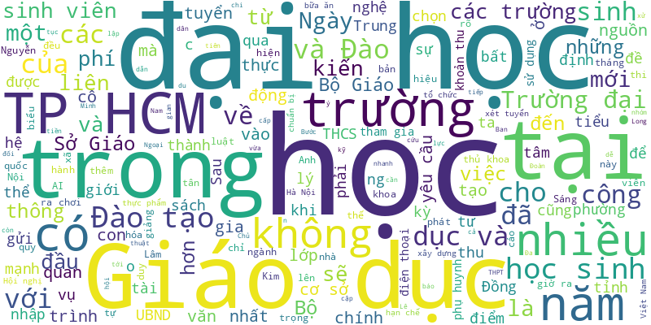

# Tuoi Tre RSS 

## Giáo dục 
- Sau năm năm triển khai, tuy chưa thực hiện trọn đủ một lứa học sinh được học toàn bộ Chương trình giáo dục phổ thông 2018 từ lớp 1 - lớp 12, nhưng đã có lứa học sinh đã học đủ các lớp cho cả ba cấp học là tiểu học, THCS và THPT.
- Chính quyền xã Tuy Phước Đông (tỉnh Gia Lai) và nhà tài trợ vừa tổ chức trồng 11.500 cây đước, để tham gia phục hồi hệ sinh thái rừng ngập mặn trên đầm Thị Nại.
- Không chỉ có tiếng Anh và toán, ngữ văn và hóa học cũng là những môn có nhiều thí sinh tại cuộc thi chọn học sinh giỏi ở TP.HCM năm nay.
- Bên cạnh học phí, tân sinh viên tại nhiều trường đại học ở Mỹ, Úc và Canada… cũng phải chuẩn bị thêm nhiều khoản phí bắt buộc.
- Lãnh đạo UBND tỉnh Đắk Lắk yêu cầu ngành giáo dục làm rõ, xử lý dứt điểm tình trạng các trường học may nhiều loại đồng phục rườm rà gây lãng phí, tốn tiền phụ huynh.
- Bộ Giáo dục và Đào tạo đặt mục tiêu đến năm 2030, Việt Nam sẽ có trên 20% chương trình liên kết với các trường thuộc top 500 thế giới, xây dựng ít nhất 2 phân hiệu của đại học quốc tế uy tín tại Việt Nam.
- Thấy cô giáo, con hơi cụp mắt xuống tránh né ánh nhìn của cô. Tôi cất tiếng hỏi han sao con không lên nhận quà tặng. Con lí nhí 'thôi cô, con không lên mô…'.
- Ngày 16-9, các công đoàn, giảng viên và sinh viên trong hệ thống giáo dục Đại học California đã kiện chính quyền ông Trump, liên quan đến vụ đóng băng các quỹ liên bang và những hành động mà họ cho rằng nhằm kìm hãm tự do học thuật.
- Đại diện hơn 3.000 tân sinh viên phát biểu tại lễ chào mừng năm học mới, thủ khoa Hiền Mai nhắn gửi thông điệp mỗi cá nhân đều là phiên bản độc nhất, đều xứng đáng với một vương miện độc bản.
- Trong báo cáo gửi Sở Giáo dục và Đào tạo tỉnh Lâm Đồng, Trường tiểu học T.V. (phường Xuân Hương - Đà Lạt) thừa nhận bếp có phản ánh thực phẩm cho bữa ăn bán trú "có dấu hiệu bất thường".
- Động thái này nối tiếp xu hướng hạn chế điện thoại thông minh trong trường học tại châu Âu, khi Pháp cũng mới siết chặt lệnh cấm điện thoại vào tháng 9.
- Câu chuyện 'hô tên chọn ngành bác sĩ nội trú' bất ngờ tạo sóng, mang đến những suy nghĩ về sức mạnh truyền thông giáo dục trong thời đại số.
- Một bộ sách giáo khoa chuẩn, thống nhất trong cả nước không phải là 'quay về lối cũ' một chương trình một bộ sách, mà phải xây dựng bộ sách giáo khoa hiệu quả hơn, dễ sử dụng.
- Sáng 17-9, hơn 3.300 học sinh lớp 10, 11, 12 ở TP.HCM bước vào kỳ thi chọn đội tuyển học sinh giỏi đầu tiên sau sáp nhập.
- RMIT Việt Nam đã kiến tạo một di sản giáo dục hiện đại, không chỉ giảng dạy kiến thức và kỹ năng thực tiễn, mà còn truyền cảm hứng sống, tư duy toàn cầu cho hàng chục thế hệ sinh viên.
- Ngoài học phí, nhiều trường đại học thu thêm loạt 'khoản thu nhập học' khiến tân sinh viên và phụ huynh bất ngờ, thậm chí choáng váng vì tổng chi phí phải đóng trong ngày đầu nhập trường quá cao.
- Đây là 1 trong 6 nội dung trọng tâm trong quản lý các trường tư thục, trung tâm ngoại ngữ, tin học… mà Sở Giáo dục và Đào tạo TP.HCM sẽ thực hiện trong năm học 2025-2026.
- Chuẩn bị cho năm học mới, TP.HCM đã đầu tư hơn 4.500 tỉ đồng từ vốn ngân sách để đưa vào sử dụng 1.434 phòng học mới. Bên cạnh đó là khoảng 181 phòng học từ nguồn xã hội hóa.
- Chính phủ yêu cầu Bộ Giáo dục và Đào tạo xây dựng đề án phát triển 3 - 5 đại học tinh hoa theo mô hình đại học nghiên cứu đẳng cấp thế giới, đào tạo nhân tài quốc gia.
- Giữa trưa, khi bữa ăn bán trú tại Trường tiểu học T.V. (phường Xuân Hương - Đà Lạt) đã được dọn lên thì nhiều phụ huynh đã đưa con rời trường vì lo ngại thực phẩm bẩn.
- Từ khi áp dụng thời khóa biểu mới "mỗi ngày không quá bảy tiết", tôi và con trai học lớp 8 phải ngồi xuống sắp xếp lại lịch sinh hoạt.
- Thủ tướng nhấn mạnh nhiệm vụ rà soát, sắp xếp, tái cấu trúc các cơ sở giáo dục đại học và giáo dục nghề nghiệp; sáp nhập, giải thể các cơ sở đào tạo không đạt chuẩn.
- Chính phủ vừa ban hành nghị quyết chương trình hành động thực hiện Nghị quyết 71 của Bộ Chính trị về đột phá phát triển giáo dục và đào tạo.
- Đại sứ quán Thụy Điển phối hợp ĐH RMIT TP.HCM tổ chức chương trình đưa giải Nobel đến gần hơn với cộng đồng học thuật Việt Nam.
- Đồng hành với thế hệ được gọi là “Gen Alpha”, Royal School chủ động dẫn dắt học sinh với tinh thần cầu thị và lắng nghe, đổi mới, sáng tạo để phù hợp với nhịp phát triển của kỷ nguyên công nghệ.
- Ngày 15-9, 172 sinh viên Trường ĐH Hoa Sen đã bắt đầu học phần thực hành Kỹ năng tạo lập văn bản truyền thông tại báo Tuổi Trẻ.
- Hiệu trưởng một trường THPT ở Cà Mau bị tố 5 nội dung, 3 đúng, đã được điều chuyển sang làm hiệu trưởng trường THPT khác.
- Bộ Giáo dục và Đào tạo vừa ban hành hướng dẫn các nhà trường mời chuyên gia, nghệ nhân, nghệ sĩ, huấn luyện viên, vận động viên về dạy học sinh.
- Lãnh đạo Bộ Tổng tham mưu Quân đội nhân dân Việt Nam khẳng định sẽ xây dựng trường vùng biên giới, có nội trú liên cấp tại xã Buôn Đôn trong tháng 10-2025.
- Một số trường đại học có nhiều khoản thu ngoài học phí khi làm thủ tục nhập học khiến sinh viên choáng, phụ huynh bức xúc.
- Tại tọa đàm 'Trái tim người mẹ - Sách và học', các diễn giả khẳng định giữa mạng xã hội bủa vây và nhiều áp lực hiện đại, đọc sách vẫn là con đường bền vững để học tập suốt đời.
- Ông Trần Lưu Quang cho biết từ ngày về làm Bí thư Thành ủy TP.HCM, ông nhận được 12 tin nhắn phản ánh việc học sinh phải đi học thêm ngày thứ Bảy. Ông Quang hỏi rõ Giám đốc Sở Giáo dục và Đào tạo TP.HCM việc này.
- Việc Sở GD-ĐT TP.HCM ban hành khung giờ vào học, tan học đối với các trường mầm non, phổ thông trên địa bàn đã khiến nhiều phụ huynh vỡ òa vì vui mừng. Nhất là những phụ huynh phải đi làm theo giờ hành chính.
- Năm 2026, Đại học Bách khoa Hà Nội dự kiến tổ chức 3 đợt thi với khoảng 60.000 lượt thi, trong đó đợt thi đầu tiên bắt đầu từ cuối tháng 1-2026.
- Nhiều phụ huynh có con vào lớp 1 năm học 2025 - 2026 thắc mắc vì sao phải đóng bảo hiểm y tế cho con 15 tháng thay vì 12 tháng.
- Hội đồng giáo sư ngành kinh tế năm 2025 vừa công bố kết luận phiên họp thứ nhất và danh sách ứng viên được trình bày báo cáo khoa học tổng quan.
- Cầm những tờ giấy về các khoản thu "tự nguyện" đầu năm học, nhiều phụ huynh dù trong lòng không muốn ký nhưng buộc phải ký vì sợ con bị chuyển lớp, bị cô giáo "đì", bị "tẩy chay"…
- Các cơ sở giáo dục ở TP.HCM phải rõ ràng các khoản thu, không nhập nhèm để tăng giá thu các môn học theo chương trình nhà trường.
- Trường cao đẳng Sư phạm trung ương Nha Trang mua vé cho toàn bộ sinh viên của trường xem phim 'Mưa đỏ'.
- Sở Giáo dục và Đào tạo cho biết 7 giáo viên người Nhật Bản đã được sở này tiếp nhận đến hỗ trợ giảng dạy tiếng Nhật tại các trường của TP.HCM.
- Một “làn sóng” đề xuất miễn học phí cho bác sĩ nội trú được chia sẻ rầm rộ trên mạng xã hội.
- Nhiều khán giả cho biết ngay sau tập 1, chương trình “Đầu Bếp Nhí - Little Chef” mang đến nhiều cảm xúc cùng một góc nhìn mới mẻ về căn bếp.
- Nhiều trường đã thực hiện công văn của Bộ GD-ĐT về việc hướng dẫn tổ chức dạy học 2 buổi/ngày và cho học sinh nghỉ học thứ Bảy.
- Các trường học và giáo viên đang phải đau đầu để xác định ranh giới giữa việc sử dụng công nghệ hỗ trợ và gian lận học thuật.
- Học viện Phật giáo Việt Nam tại Hà Nội vừa trao bằng tiến sĩ Phật học thứ 2 cho Đại đức Thích Minh Nghĩa (Trương Thanh Hải).
- Trẻ em ngày nay có xu hướng ít chia sẻ với cha mẹ. Ví dụ khi con đi học về, mẹ hỏi 'hôm nay ở trường có gì vui không con?', thì con tỏ ra bực bội.
- Bác sĩ nội trú chỉ là khởi đầu của hành trình mới, cần tiếp tục tu dưỡng - GS.TS Nguyễn Duy Ánh chia sẻ.
- Khoảng cách thế hệ luôn là vấn đề được nhiều người quan tâm, nhất là trong bối cảnh Gen Z đang từng bước trưởng thành, giữ vai trò quan trọng và dần trở thành những nhà lãnh đạo tương lai của xã hội.
- Dù nhiều trường tại TP.HCM đã siết chặt quy định cấm học sinh sử dụng điện thoại và yêu cầu phụ huynh ký cam kết, thực tế việc quản lý lại nảy sinh nhiều mâu thuẫn.
- Cuộc thi tiếng Anh và tài năng Speak Up do ILA tổ chức đã trở thành một trong những sân chơi giáo dục - nghệ thuật quy mô lớn dành cho học sinh từ 8 đến 16 tuổi.

## Thời Sự 
- Một số tin tức đáng chú ý: Phát hiện người có liên quan đến chủ tịch SMC giao dịch 'chui' cổ phiếu; Lượng người tham gia đa cấp giảm; Lãnh đạo doanh nghiệp nhà nước có thể nhận lương 300 triệu/tháng...
- Hôm nay 18-9, thời tiết cả nước mưa dông diện rộng, nhiều nơi mưa to. Trên biển khả năng áp thấp nhiệt đới ở Philippines sẽ vào và thành bão.
- Công an tỉnh Quảng Trị ra quyết định khởi tố vụ án, khởi tố bị can và bắt tạm giam tài xế lao xe vào chợ làm 3 người chết.
- Chiếc xe máy nằm lọt dưới gầm xe tải chở heo khiến hai người chết, một bé gái khoảng 8 tuổi bị thương được đưa đi cấp cứu.
- Cục trưởng Cục Cảnh sát giao thông - Thiếu tướng Đỗ Thanh Bình cho biết đơn vị sẽ nghiên cứu, đề xuất sửa luật theo hướng đường cao tốc có 2 làn trở lên sẽ bố trí 1 làn để vượt.
- Bí thư Thành ủy TP.HCM Trần Lưu Quang dẫn tiêu đề bài hát và yêu cầu các sở, ngành đã trả lời kiến nghị tại cuộc họp thì cần thực hiện lời hứa, đã hứa là phải làm.
- Tối 17-9, giao thông trên đường Nơ Trang Long (phường Bình Thạnh, TP.HCM) rơi vào hỗn loạn do đèn tín hiệu tại ngã ba Nơ Trang Long - Phan Chu Trinh liên tục màu đỏ, không chuyển trạng thái trong thời gian dài.
- Bí thư Đảng ủy xã Lao Bảo cho hay đã kiến nghị di dời chợ chuối Tân Long đến vị trí khác rộng 3ha, khái toán đầu tư khoảng 6-8 tỉ đồng và được lãnh đạo tỉnh Quảng Trị đồng ý.
- Kết luận của Phó thủ tướng Trần Hồng Hà về xử lý ô nhiễm môi trường không khí, ô nhiễm các dòng sông trên địa bàn TP Hà Nội và TP.HCM.
- Ông Lại Thế Nguyên và ông Đỗ Minh Tuấn đã được Trung ương cho nghỉ hưu trước tuổi từ ngày 12-9-2025.
- Chiều 17-9, Phó thủ tướng thường trực Chính phủ Nguyễn Hòa Bình chủ trì cuộc họp với lãnh đạo các bộ, ngành, cơ quan về tình hình triển khai thực hiện và vận hành mô hình chính quyền địa phương 2 cấp.
- TP.HCM kiến nghị sửa đổi quy định Luật Đất đai 2024 về định giá đất cụ thể, để gỡ vướng gần 100 dự án bất động sản ở TP.HCM.
- Đối với nhà đất công ở TP.HCM được Trung tâm Phát triển quỹ đất cho thuê ngắn hạn, giao UBND xã, phường sớm thực hiện thủ tục chấp thuận cho xây dựng tạm để tránh lãng phí đất, Nhà nước thu được thuế.
- Xe buýt chạy vào làn xe máy, liên tục bấm còi inh ỏi, vượt phải ở quốc lộ 20 khiến nhiều người đi đường một phen hoảng hốt.
- Hai người Trung Quốc vay tiền để đánh bạc đến hàng trăm ngàn nhân dân tệ. Khi thua bạc, họ bị ép viết giấy nợ, khống chế, đánh đập, buộc gọi điện về gia đình chuyển tiền.
- Lãnh đạo UBND tỉnh Đắk Lắk yêu cầu ngành giáo dục làm rõ, xử lý dứt điểm tình trạng các trường học may nhiều loại đồng phục rườm rà gây lãng phí, tốn tiền phụ huynh.
- ông Nguyễn Hoài Anh - Ủy viên dự khuyết Trung ương Đảng, Phó bí thư Tỉnh ủy Thanh Hóa - cam kết nỗ lực hết mình vì sự phát triển của tỉnh nhà.
- Các bác sĩ nội trú ở nhiều chuyên ngành vẫn phải đóng mức học phí cao, khoảng 74 triệu đồng mỗi năm, có nơi lên đến gần 900 triệu đồng.
- UBND TP.HCM thành lập Hội đồng thi tuyển phương án kiến trúc cầu đường Bình Tiên - công trình trọng điểm kết nối trung tâm thành phố với khu Nam.
- Tổng Bí thư Tô Lâm nhấn mạnh đô thị hiện đại là văn minh, vừa là động lực của phát triển, đồng thời nông thôn giàu đẹp, văn hóa, bền vững là hậu phương vững chắc.
- Chiều 17-9, tại kỳ họp thứ 33, HĐND tỉnh Thanh Hóa khóa XVIII đã bầu ông Nguyễn Hoài Anh - 48 tuổi, Phó bí thư Tỉnh ủy - giữ chức Chủ tịch UBND tỉnh Thanh Hóa nhiệm kỳ 2021-2026
- Bạn đọc Tuổi Trẻ Online nêu ý kiến, gợi ý nhiều giải pháp để giảm tình trạng kẹt xe và xe máy chạy lên vỉa hè.
- Cầu Bình Triệu 1 và Bình Phước 1 sau khi được nâng tĩnh không sẽ giúp tàu thuyền đi lại dễ hơn trên sông Sài Gòn. Nhưng TP.HCM vẫn còn những nhánh sông, kênh rạch có cầu cũ, thấp… cần nâng hoặc thay mới để giao thông thủy thông suốt.
- Bà Phạm Thị Xuân Trang - Phó chủ tịch HĐND tỉnh Khánh Hòa - được phân công điều hành hoạt động của HĐND tỉnh, Thường trực HĐND tỉnh Khánh Hòa khóa VII, nhiệm kỳ 2021 - 2026.
- Đề nghị các cán bộ nói thẳng vào các vấn đề cần kiến nghị, không lòng vòng, phát huy thế mạnh vốn có, là những gợi mở của Bí thư Thành ủy TP.HCM Trần Lưu Quang khi làm việc với phường Bình Dương.
- 2 thanh niên tại xã Phù Mỹ Tây (Gia Lai) được phát hiện nằm chết giữa ruộng lúa khi đi bắn chim trong đêm, nghi bị dính điện bẫy chuột.
- Áp thấp nhiệt đới ở gần Biển Đông có khả năng mạnh lên thành bão và đi vào Biển Đông trong ngày mai, vì vậy Khánh Hòa đã lên phương án ứng phó phòng ngừa các tình huống thiên tai bất ngờ xảy ra, đặc biệt là vùng vừa bị lũ ống ở xã Lâm Sơn.
- UBND tỉnh Khánh Hòa kiến nghị Quốc hội, Chính phủ xem xét sửa đổi, bổ sung một số cơ chế, chính sách đặc thù để triển khai Nghị quyết 189/2025/QH về đầu tư xây dựng Nhà máy điện hạt nhân Ninh Thuận 1 và 2.
- Sáng 17-9, Đại tướng Nguyễn Tân Cương, Tổng Tham mưu trưởng Quân đội nhân dân Việt Nam, Thứ trưởng Bộ Quốc phòng, đã hội đàm với Thiếu tướng Dato Paduka Seri Haji Muhammad Haszaimi Bin Bol Hassan, Tư lệnh Quân đội Hoàng gia Brunei.
- Rời trường học về nhà, nam sinh lớp 11 đi xe máy bị xe bồn cán tử vong. Người mẹ hay tin chạy đến hiện trường gào khóc bên thi thể con.
- Công ty cổ phần Phát triển Nông nghiệp Hòa Phát (HPA) công ty con của Tập đoàn Hòa Phát do ông Trần Đình Long làm Chủ tịch đã nộp hồ sơ IPO lên Ủy ban Chứng khoán Nhà nước.
- TP.HCM hiện có hơn 100 tuyến xe buýt triển khai vé điện tử, giúp hành khách thuận tiện thanh toán, góp phần phát triển giao thông công cộng xanh.
- Ngày 17-9, Bệnh viện Quân y 120 chính thức đưa vào hoạt động trung tâm tiêm chủng vắc xin, thực hiện nhiệm vụ tiêm chủng cho các đối tượng trong và ngoài quân đội, chủ động phòng chống dịch bệnh và chăm sóc sức khỏe cộng đồng.
- Trong báo cáo gửi Sở Giáo dục và Đào tạo tỉnh Lâm Đồng, Trường tiểu học T.V. (phường Xuân Hương - Đà Lạt) thừa nhận bếp có phản ánh thực phẩm cho bữa ăn bán trú "có dấu hiệu bất thường".
- Thường trực Ban Bí thư Trần Cẩm Tú nêu rõ kỳ vọng đưa Đà Nẵng gia nhập nhóm các thành phố cạnh tranh toàn cầu tại Đại hội đại biểu lần thứ I Đảng bộ thành phố Đà Nẵng nhiệm kỳ 2025 - 2030.
- Việc nâng tĩnh không cầu Bình Triệu 1 (TP.HCM) đến cuối năm 2025 mới xong, giao thông khu vực hay kẹt. Người dân mong phà Bình Quới chạy lại để có thêm hướng đi, giảm áp lực lên cầu và thuận tiện đi lại hằng ngày.
- Lực lượng chức năng vừa tìm thấy thi thể người vợ trong vụ lật ghe khi cùng chồng sang sông để hái rau tại xã Phú Hòa 1, Đắk Lắk.
- Ra mắt 75 nhân sự tham gia Ban Chấp hành Đảng bộ thành phố Đà Nẵng khóa I, nhiệm kỳ 2025 - 2030.
- TS Tô Văn Trường cho rằng điều làm nên sự khác biệt của cố Bộ trưởng Lê Huy Ngọ chính là tính cách thẳng thắn, liêm chính và hết lòng vì nông dân.
- Công an xã Lao Bảo ban đầu xác định nguyên nhân vụ tai nạn nghiêm trọng khiến 3 người chết, 9 người bị thương là do xe tải mất phanh, tài xế và người đi cùng không có nồng độ cồn, ma túy.
- Trong quá trình đánh bắt cá ở khu vực Hòn Nghệ, 4 người dân bị chìm tàu rồi trôi dạt lênh đênh trên biển suốt nhiều giờ liền. Các thuyền viên hãng phà, tàu cao tốc Superdong VII cứu vớt thành công. Sức khỏe các ngư dân trên ổn định.
- Chỉ còn chưa đầy 2 tuần nữa, các cơ sở khám chữa bệnh trên cả nước, trong đó có TP.HCM, phải hoàn tất việc triển khai hồ sơ bệnh án điện tử thay cho bệnh án giấy.
- Do tình huống bất ngờ, tài xế ô tô không kịp đánh lái đã tông phải xe đạp. Sau cú va chạm mạnh, người đàn ông đi xe đạp tử vong tại chỗ, 2 xe hư hỏng.
- Hơn 700 đại biểu tham dự Đại hội Thi đua quyết thắng toàn quân lần thứ XI, sẽ được tổ chức tại Hà Nội ngày 24-9.
- Ngày 17-9, mạng xã hội đăng tải đoạn clip khoảng 17 giây ghi lại sự việc một chiếc xe bồn trộn bê tông vượt đèn đỏ tại một giao lộ ở xã Bình Mỹ, TP.HCM.
- Sáng 17-9, tại Tỉnh ủy Thanh Hóa, Ban Thường vụ Tỉnh ủy Thanh Hóa tổ chức hội nghị công bố quyết định của Bộ Chính trị, Ban Bí thư về công tác cán bộ. Ông Nguyễn Hoài Anh và ông Nguyễn Hồng Phong giữ chức Phó bí thư Tỉnh ủy Thanh Hóa.
- Liên quan vụ phân lô nền trái phép ở Phú Quốc, Công an tỉnh An Giang bắt tạm giam Vũ Văn Nam, Lê Nam Trung và ra lệnh cấm đi khỏi nơi cư trú Lê Tiến Phong và truy nã Trần Tam Điệp để điều tra về tội cưỡng đoạt tài sản hàng tỉ đồng.
- Hàng rào sắt được lắp đặt trên cầu Nhật Tân (Hà Nội). Cây cầu huyết mạch từ nay sẽ được phân cách cứng thành 3 làn ô tô và 1 làn xe máy.
- Đà Nẵng đặt mục tiêu triển khai thành công các mô hình kinh tế mới như: Trung tâm tài chính quốc tế, Khu thương mại tự do, mô hình "5 cao", trở thành cực tăng trưởng của Việt Nam.
- Tại diễn đàn với gần 1.000 đại biểu tham dự (phần lớn là những doanh nhân) đã có nhiều câu hỏi lớn của Thủ tướng được tán thành và cũng có nhiều đề xuất.

## Nhịp sống số 
- Úc sắp cấm người dưới 16 tuổi dùng mạng xã hội, nhưng cho phép các nền tảng như Facebook và TikTok có sai số khi kiểm tra độ tuổi.
- Tập đoàn viễn thông SK Telecom ngày 16-9 khẳng định toàn bộ dữ liệu khách hàng bị rao bán trên trang web đen là giả, nghi đây là một chiêu trò lừa đảo có tổ chức.
- Đây là lần đầu tiên các hãng truyền thông ở Mỹ khởi kiện Google về tính năng 'AI Overviews' mới trên công cụ tìm kiếm vì đã gây ảnh hưởng nghiêm trọng đến traffic.
- Bộ Công an khẳng định nhiều thông tin lan truyền về "lộ dữ liệu" ở các cơ quan, tổ chức là tin giả, gây hoang mang dư luận.
- Nội dung rác do trí tuệ nhân tạo (AI) tạo ra đang lan rộng trên mạng xã hội, gây lo ngại ảnh hưởng tiêu cực đến não bộ người dùng.
- Các trường học và giáo viên đang phải đau đầu để xác định ranh giới giữa việc sử dụng công nghệ hỗ trợ và gian lận học thuật.
- Thông tin sai lệch xoay quanh vụ ám sát nhà hoạt động chính trị Charlie Kirk đang lan truyền rất nhanh, bao gồm thông tin từ chatbot Gork AI của tỉ phú Elon Musk.
- Trợ lý ảo dần trở thành lựa chọn đầu tiên khi người dùng tìm kiếm thông tin. Liệu Google Search có còn duy trì vị thế trung tâm hay phải thích ứng trước sự thay đổi này?
- Thời gian gần đây, trên mạng xã hội xuất hiện nhiều video 'ép' chatbot phải thực hiện lệnh đếm số từ 1 tới 1 triệu. Chuyên gia nhận định đây chỉ là một hành động giải trí vô nghĩa và ảnh hưởng lớn tới nhà phát hành.
- iPhone 17 không chỉ là nâng cấp chip và camera. Từ iPhone Air siêu mỏng, eSIM only, đến chip mạng N1 đầy tham vọng.
- Thế hệ iPhone 17 series của Apple được ra mắt với thay đổi về mặt ngoại hình lớn nhất trong nhiều thế hệ qua.
- Các bác sĩ đã ghi nhận nhiều trường hợp bệnh nhân nhập viện vì 'loạn thần AI' sau khi sử dụng chatbot trị liệu trong thời gian dài.
- Việc quảng cáo xuất hiện trùng khớp với mong muốn của người dùng khiến nhiều người nghi ngờ rằng điện thoại của họ đang bị nghe lén.
- Các chương trình AI đạt được nhiều thành tựu ấn tượng, song nghiên cứu mới nhấn mạnh không nên cường điệu khả năng suy luận của AI.
- Tội phạm mạng tại Hải Phòng đang diễn biến phức tạp, 8 tháng đầu năm lực lượng chức năng đã xử lý 122 vụ lừa đảo công nghệ cao.
- Đối với nhiều website, đặc biệt là các trang sản phẩm, e-commerce, hình ảnh thường được người dùng yêu cầu nhiều nhất và chiếm nhiều băng thông hơn bất kỳ tài nguyên nào khác.
- Big Tech đang tiếp tục rót hàng trăm tỉ USD vào trí tuệ nhân tạo, biến AI thành cuộc chơi lên đến nghìn tỉ đô. Người dùng sẽ thực sự được gì?
- Sau nhiều tranh cãi về độ an toàn của trí tuệ nhân tạo với trẻ vị thành niên, OpenAI chính thức bổ sung công cụ kiểm soát trẻ trên ChatGPT.
- Mức phạt đối với Google là 325 triệu euro (379 triệu USD), trong khi Shein bị phạt 150 triệu euro (175 triệu USD).
- Trong bối cảnh Apple sắp ra mắt dòng iPhone 17 mới, xuất hiện nhiều dự báo về giá cả khiến cộng đồng công nghệ bất ngờ.
- Google bác bỏ tin đồn trên mạng xã hội cho rằng hãng đã gửi cảnh báo khẩn đến 2,5 tỉ người dùng Gmail sau một vụ rò rỉ dữ liệu.
- Việc Meta đàm phán sử dụng các mô hình AI của Google và OpenAI là dấu hiệu rõ ràng về sự thay đổi lớn trong chiến lược của những 'gã khổng lồ' công nghệ.
- Microsoft và hãng sản xuất bộ điều khiển SSD Phison bác bỏ tin đồn lan truyền trên mạng xã hội hồi tháng 8 cho rằng các bản cập nhật Windows 11 đã gây lỗi nghiêm trọng, làm hỏng ổ SSD.
- Khu trưng bày ngành game, ngành điện ảnh và ngành thủ công mỹ nghệ trở thành tâm điểm thu hút giới trẻ ở Triển lãm thành tựu đất nước.
- Microsoft vừa công bố hai mô hình AI đầu tiên do chính tập đoàn phát triển, trong đó có mô hình tạo 1 phút âm thanh chỉ trong 1 giây.
- Việc TP Đà Nẵng thí điểm dự án chuyển đổi tài sản mã hóa đang thu hút nhiều quan tâm. Chủ tịch Tập đoàn Công nghệ Kogi, nguyên chủ tịch Hiệp hội Doanh nhân Việt Nam tại nước ngoài Peter Hồng (Nguyễn Hồng Huệ) nói "thế giới đã đánh hơi được".
- Cơ quan Cảnh sát Quốc gia Nhật Bản mới đây xác nhận sẽ đưa ứng dụng trí tuệ nhân tạo (AI) vào việc phân tích thông tin nhằm truy bắt các đối tượng cầm đầu của nhóm tội phạm ẩn danh và lưu động xuyên quốc gia.
- Một số video trên YouTube bỗng hiển thị khác với bản gốc, từ màu sắc đến độ nét đều được tự động thay đổi. Vì sao có chuyện này, và liệu người sáng tạo có thể kiểm soát?
- Một buổi sáng, bạn bật máy tính. Trên màn hình không chỉ là danh sách công việc mà cả giờ ăn, lịch nghỉ, lộ trình di chuyển cũng được phần mềm AI lập trình sẵn, tối ưu đến từng phút.
- Các chuyên gia cảnh báo thông tin sai lệch kém rõ ràng và nguy hiểm đang được phát tán thông qua các tính năng AI của Google.
- Học sinh ở Hàn Quốc sẽ bị cấm sử dụng điện thoại thông minh và thiết bị thông minh trong giờ học, theo luật mới được Quốc hội thông qua.
- Diễn ra từ 26, 27-8, triển lãm và diễn đàn quy mô nhất nước chuyên ngành khách sạn, nhà hàng, cà phê, dịch vụ ăn uống HorecFex Việt Nam 2025, không chỉ là không gian gặp gỡ của doanh nghiệp mà còn là sân chơi để phô diễn những xu thế công nghệ mới.
- Nhiều tin đồn xoay quanh iPhone 17, Apple Watch và AirPods rộ lên khi gần đến thời điểm ra mắt các sản phẩm mới của Apple.
- Đơn kiện cáo buộc Apple và OpenAI 'thông đồng' để làm giảm sức cạnh tranh trong lĩnh vực trí tuệ nhân tạo (AI).
- Nhiều người dùng tin rằng chatbot AI thông minh hơn khi trả lời bằng tiếng Anh. Nhưng liệu đây có phải là sự thật, hay chỉ là tin đồn nảy sinh từ thói quen sử dụng công nghệ?
- vivo V60 5G sẽ ra mắt vào ngày 26-8-2025 với Hệ thống camera chính ZEISS, Camera Siêu Tele Chân Dung ZEISS và loạt ưu đãi hấp dẫn khi đặt trước lên đến sáu triệu đồng
- Không chỉ nghe, nhìn, nói, AI giờ đây còn có thể “ngửi mùi”. Công nghệ khứu giác số mở ra ứng dụng từ y tế hơi thở, kiểm định thực phẩm, đến tạo ra những hương nước hoa độc bản chỉ trong vài cú nhấp chuột.
- Apple thông báo sẽ sản xuất toàn bộ dòng sản phẩm iPhone 17 tại các nhà máy đặt tại Ấn Độ, dấu hiệu rõ ràng cho thấy họ đang 'hạn chế' phụ thuộc vào Trung Quốc.
- Theo OpenAI, ChatGPT Go cho phép người dùng gửi số lượng tin nhắn và tạo hình ảnh gấp 10 lần so với bản miễn phí, đồng thời có tốc độ phản hồi nhanh hơn.
- Hằng tháng có 280 triệu người dùng ứng dụng chỉnh sửa ảnh AI Meitu, trong đó 98 triệu đến từ các thị trường ngoài Trung Quốc đại lục.
- Instagram Map ra đời nhằm xóa mờ ranh giới giữa thế giới ảo và thực, nhưng thay vì kết nối mọi người, nó lại khiến người dùng lo bị theo dõi.
- Thông tin lan truyền rằng tính năng Meta AI trên WhatsApp mặc định truy cập mọi cuộc trò chuyện nếu không bật "Advanced Privacy".
- Chỉ bằng vài câu lệnh, AI đã có thể dựng nên những khung hình sống động, từ bối cảnh, ánh sáng đến từng chuyển động nhỏ... Nó làm điều đó thế nào?
- Các nhà báo châu Âu ngày càng sử dụng nhiều công cụ AI tạo sinh trong tòa soạn, bất chấp lo ngại công nghệ này có thể làm phát sinh tin giả và xói mòn niềm tin.
- Một dạng video mới mang tên “bác sĩ deepfake” đang lan truyền trên mạng xã hội, với các nhân vật trông và nghe như thật nhưng thực chất chỉ là sản phẩm của xu hướng AI mới nhất.
- Chỉ điện thoại tích hợp AI, du khách sẽ 'đọc' được những chữ tượng hình trên bức tượng, tờ giấy cói... của nền văn minh Ai Cập cổ đại.
- Điều tra của Full Fact phát hiện Google Lens cung cấp thông tin sai hoặc gây hiểu nhầm về hình ảnh lan truyền trên mạng.
- Chính phủ Hàn Quốc vừa quyết định tạm hoãn việc phê duyệt yêu cầu của Google về quyền truy cập và xuất khẩu dữ liệu bản đồ địa lý chi tiết của quốc gia này, một bước đi nhằm thận trọng đánh giá các rủi ro an ninh liên quan đến dữ liệu số.
- Nếu hệ thống xác định một người dùng dưới 18 tuổi, YouTube sẽ hạn chế truy cập những nội dung không phù hợp lứa tuổi.
- DeepSeek, mô hình AI của Trung Quốc, đã gây chấn động thị trường khi chứng minh rằng có thể tạo ra một mô hình mạnh mẽ với chi phí thấp.

